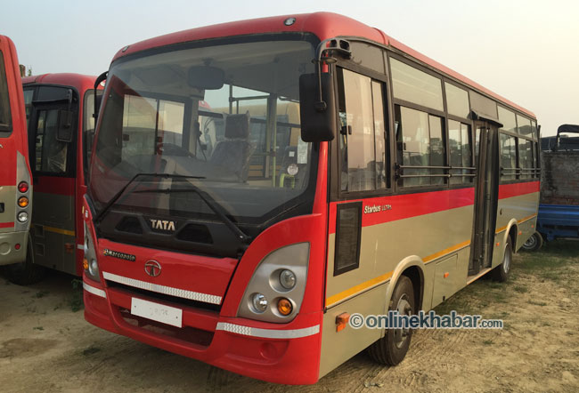
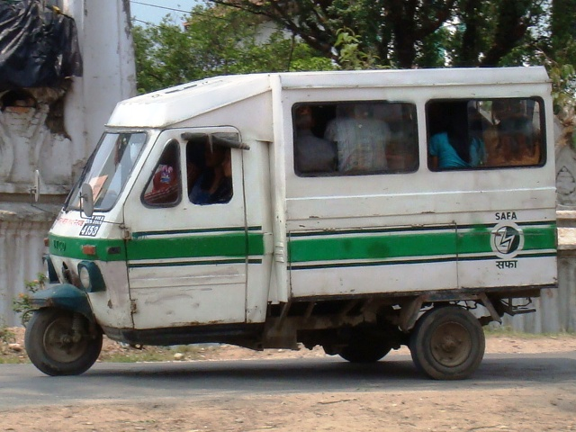
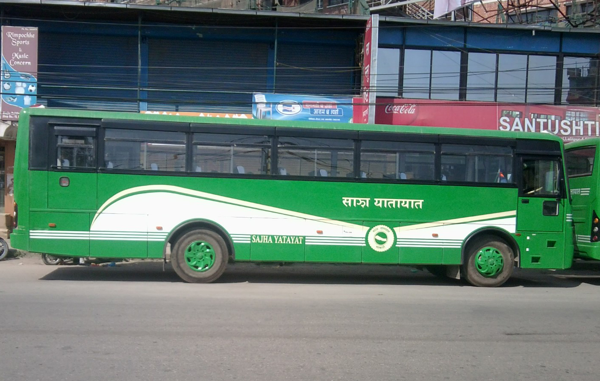
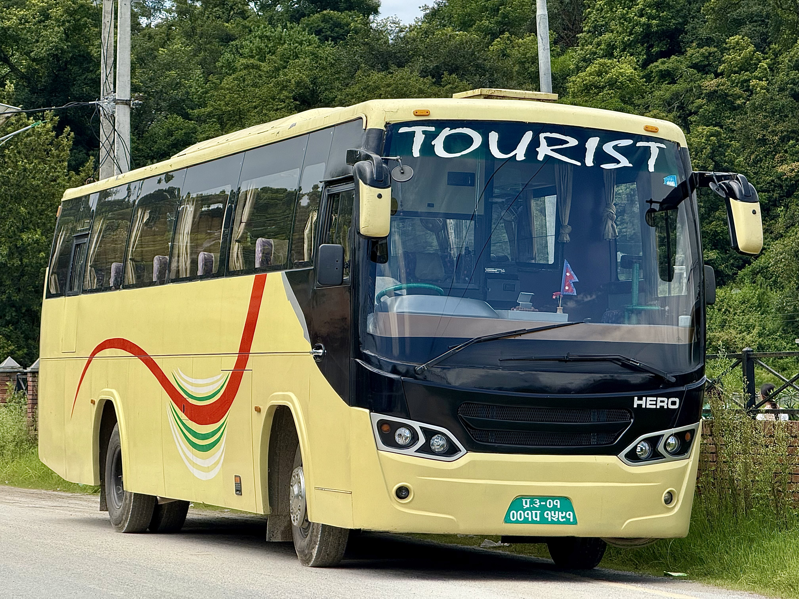
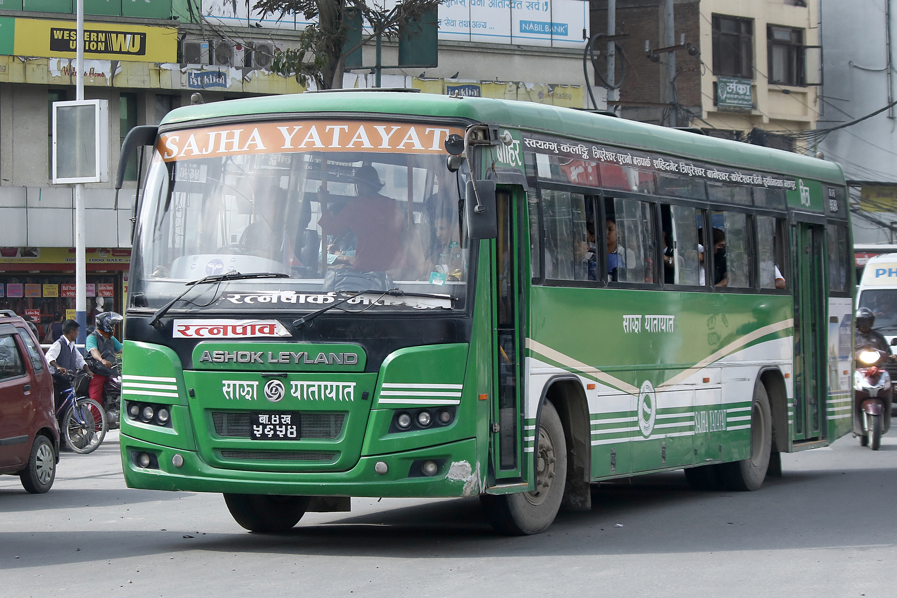
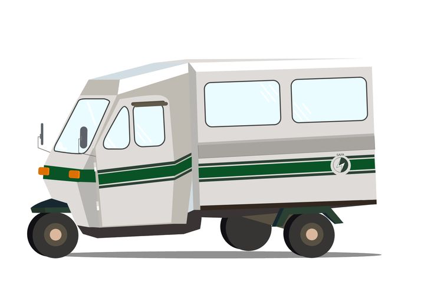
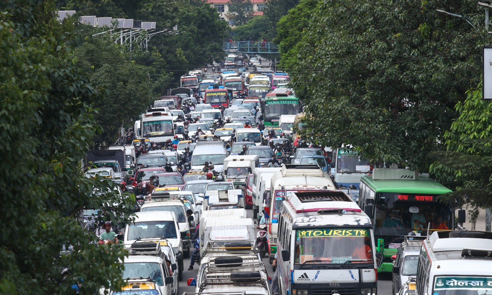
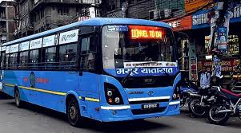
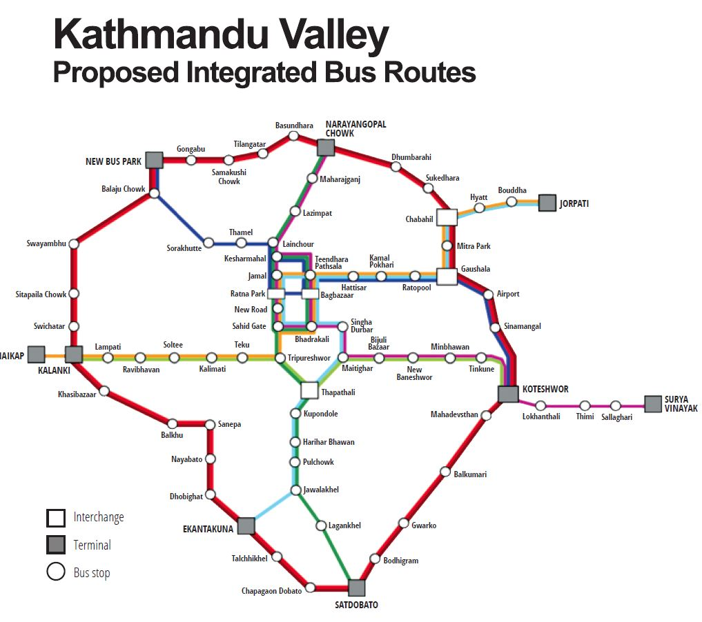

<p align="center">
  
</p>

<h1 align="center">🚌 Sawari — सवारी</h1>
<h3 align="center">AI-Powered Public Transit Navigation for Kathmandu Valley</h3>

<p align="center">
  <em>Your smart companion for navigating buses, tempos, and microbuses — with real routes, live fares, and AI-powered guidance.</em>
</p>

<p align="center">
  
  
  
  
  
  
</p>

<p align="center">
  <a href="#-quick-start">Quick Start</a> •
  <a href="#-features">Features</a> •
  <a href="#-architecture">Architecture</a> •
  <a href="#-tech-stack">Tech Stack</a> •
  <a href="#-iot-hardware">Hardware</a> •
  <a href="#-api-reference">API</a> •
  <a href="#-documentation">Docs</a> •
  <a href="#-contributing">Contributing</a>
</p>

---

## 📋 Table of Contents

- [Why is Sawari Needed? (The Problem)](#-why-is-sawari-needed-the-problem)
- [What Is Sawari?](#-what-is-sawari)
- [How It Works](#-how-it-works)
- [Features](#-features)
  - [Public Navigator](#-public-navigator)
  - [Admin Dashboard](#-admin-dashboard)
  - [AI Capabilities](#-ai-capabilities)
  - [Community-Driven Data](#-community-driven-data)
- [Architecture](#-architecture)
- [Tech Stack](#-tech-stack)
- [IoT Hardware](#-iot-hardware)
  - [GPS Telemetry Device](#-gps-telemetry-device)
  - [Bus Camera System](#-bus-camera-system)
- [API Reference](#-api-reference)
- [Quick Start](#-quick-start)
- [Project Structure](#-project-structure)
- [Data Coverage](#-data-coverage)
- [Documentation](#-documentation)
- [Gallery](#-gallery)
- [Contributing](#-contributing)
- [Team](#-team)
- [License](#-license)

---

## 🎯 Why is Sawari Needed? (The Problem)

Getting around Kathmandu Valley by public transit is a daily struggle for millions. The current system is heavily informal and lacks centralized information, creating major hurdles for both locals and tourists. Here are the key pain points Sawari addresses:

| Challenge | Impact |
|-----------|--------|
| **No official transit app** | Commuters rely heavily on asking strangers, word-of-mouth, or resorting to expensive taxis. |
| **Dozens of overlapping routes** | It is nearly impossible to know which bus, microbus, or tempo goes where without extensive local knowledge. |
| **No real-time tracking** | Passengers wait blindly at stops with no way to know when or if the next vehicle is arriving. |
| **Opaque fare system** | Passengers often overpay, face disputes with conductors, or don't know their discount eligibility (e.g., student cards). |
| **No digital route data** | Transit information exists almost entirely offline, making trip planning impossible. |
| **No feedback mechanism** | Wrong routes, missing stops, and route changes go unreported and unupdated. |

**Kathmandu's transit system serves over 4 million people daily, yet operates with zero digital infrastructure for passengers.** Sawari bridges this critical gap by democratizing transit data, introducing accountability, and making public commuting predictable, accessible, and empowering for everyone.

---

## 🚌 What Is Sawari?

**Sawari** (सवारी — meaning "ride" or "vehicle" in Nepali) is a comprehensive, AI-powered public transit navigation platform purpose-built for the unique commuting landscape of Kathmandu Valley. Think of it as **Google Maps meets hyper-local transit intelligence** — designed specifically from the ground up for Nepal's unique network of public buses, microbuses, and tempos.

Unlike traditional navigation apps that rely on highly structured, government-provided municipal data (which doesn't exist here), Sawari is built to handle the dynamic, community-driven, and often informal nature of local transit. It helps users intuitively find optimal routes, calculates accurate standardized fares, and provides real-time vehicle tracking and passenger density monitoring through custom-built IoT hardware.

Sawari is a **full-stack solution** spanning three integrated layers:

| Layer | What It Does |
|-------|-------------|
| 🌐 **Web Application** | Browser-based transit navigator + admin dashboard — no app download needed |
| 🤖 **AI Engine** | Natural language navigation, chatbot, task extraction, admin assistant — powered by Groq Llama 3.3 70B |
| 📡 **IoT Hardware** | ESP32-based GPS telemetry + onboard camera for real-time vehicle tracking and monitoring |

---

## ⚙️ How It Works

```
  ① Open the app          ② Tell it where to go       ③ Get your route
  ─────────────          ──────────────────────       ─────────────────
  Browser — no           "Ratnapark to Lagankhel"     Which bus, where to
  download needed        or tap the map               board, where to exit

  ④ See the fare          ⑤ Track your bus            ⑥ Rate & improve
  ──────────────          ────────────────            ────────────────
  DoTM tariff rates,     Real-time GPS position       Star ratings + submit
  student discounts      on the map                   route corrections
```

### Step-by-Step Flow

1. **Open** → Navigate to the web app in any browser (mobile, tablet, or desktop)
2. **Input** → Type a place name, tap the map, use GPS, or speak naturally — *"take me from Bagbazar to Basundhara"*
3. **AI Processing** → Groq LLM extracts locations → Nominatim geocodes → OSRM calculates road-snapped routes
4. **Route Display** → Best bus route shown with boarding/alighting stops, transfer points, walking directions
5. **Fare & Impact** → Nepal DoTM tariff fare breakdown with student/elderly discounts + CO₂ savings vs car
6. **Live Tracking** → Nearest vehicles assigned to your route with real-time position and ETA

---

## ✨ Features

### 🗺️ Public Navigator

#### Smart Navigation
| Feature | Description |
|---------|-------------|
| **Natural Language Input** | Type *"Bagbazar to Basundhara"* — AI understands and routes you |
| **Direct Routes** | Single bus routes with no transfers |
| **Transfer Routes** | Two-bus journeys via shared stops when no direct route exists |
| **Multi-Candidate Search** | Searches all stops within 800m radius for optimal start/end points |
| **Walking Fallback** | Provides walking directions when no transit option is available |
| **OSRM Road-Snapped Polylines** | Accurate road-following route lines with direction arrows |
| **Obstruction Avoidance** | Backend scores multiple route alternatives against active road blockages |
| **Draggable Markers** | Drag start/end points on the map; swap with one click |

#### Fare Calculator
| Feature | Description |
|---------|-------------|
| **Nepal DoTM Tariff Rates** | Official government fare calculation |
| **Bus vs Microbus Range** | Shows both fare types side-by-side |
| **Student/Elderly Discounts** | ~25% off, automatically displayed |
| **Realistic Rounding** | Fares rounded to nearest Rs 5 (how fares work in practice) |
| **Per-Leg Breakdown** | Individual fare for each leg of transfer routes |

#### Live Vehicle Tracking
| Feature | Description |
|---------|-------------|
| **3-Second Polling** | Near real-time position updates from fleet |
| **Smooth Animation** | Cubic easing with 2.5-second transition for natural marker movement |
| **Vehicle Assignment** | Nearest vehicles ranked by ETA + distance for each journey leg |
| **Selectable Vehicles** | Choose from multiple available vehicles per leg |
| **Type Detection** | Identifies bus / microbus / tempo / van from name and icon |
| **ETA Calculation** | Speed + haversine distance → estimated arrival time |

#### Environmental Impact
| Feature | Description |
|---------|-------------|
| **CO₂ Comparison** | Car (170 g/km) vs Bus (50 g/km) |
| **Dynamic Display** | Shows grams or kilograms depending on trip length |
| **Green Card UI** | Prominently displayed alongside fare information |

#### GPS Integration
| Feature | Description |
|---------|-------------|
| **Real-Time Tracking** | `watchPosition` API with accuracy circle on map |
| **Compass Heading** | Device orientation shown via `DeviceOrientation` API |
| **Nearby Stops** | Automatically discovers walkable stops from your position |
| **One-Tap Start** | Set your GPS location as the journey start point |
| **Follow Mode** | Map auto-centers as you move |

#### Search & Autocomplete
| Feature | Description |
|---------|-------------|
| **Local + Online** | Instant offline stop/route search + Nominatim geocoding |
| **Kathmandu Bounded** | Search results limited to valley viewbox |
| **Section Headers** | Results grouped by Stops / Routes / Places |
| **LRU Cache** | 100-entry cache with 10-minute TTL for place results |
| **Smart Debounce** | In-flight request cancellation prevents stale results |

#### UI & Experience
| Feature | Description |
|---------|-------------|
| **Dark / Light Theme** | Toggle with matched CARTO tile layers, persisted in localStorage |
| **Responsive Layout** | Optimized for mobile, tablet, and desktop breakpoints |
| **Keyboard Shortcuts** | `/` Search · `?` Help · `Enter` Navigate · `T` Theme · `E` Explore · `G` GPS · `N` Nearby · `Esc` Close |
| **Explore Routes** | Scrollable filterable list — click to highlight any route on the map |
| **Star Ratings** | Rate routes and vehicles 1–5 stars; running averages server-side |
| **Stats Bar** | Live clock, stop count, route count, vehicle count |
| **Toast Notifications** | Info / success / error / warning with auto-dismiss |
| **Skeleton Loading** | Smooth loading states during data fetch |
| **Share Route** | Copy route summary to clipboard |

---

### 🛠️ Admin Dashboard

A full-featured, password-protected workspace for managing all transit data.

#### Workspace Layout
```
┌──────────────────────────────────────────────────────────────┐
│  ⌘ Command Bar        [Search Ctrl+K] [AI Ctrl+I] [Logout]  │
├──────────┬───────────────────────────────────┬───────────────┤
│          │                                   │               │
│  Layer   │         Map Canvas                │  Inspector    │
│  Panel   │         (Leaflet)                 │  Panel        │
│          │                                   │               │
│  Stops   │                                   │  Properties   │
│  Routes  │                                   │  Relations    │
│  Vehicles│                                   │  Actions      │
│  Obstruct│                                   │               │
│          │                                   │               │
├──────────┴───────────────────────────────────┴───────────────┤
│  Status Strip: Sync ✓ │ Last 3 actions │ Entity counts      │
└──────────────────────────────────────────────────────────────┘
```

#### Entity Management

| Entity | Capabilities |
|--------|-------------|
| **Stops** | Full CRUD · FontAwesome icon picker · image icons · color picker · dependency checks before deletion |
| **Routes** | Multi-step builder · drag-reorder stops · snap to road · color / style (solid, dashed, dotted) / weight controls · preview polyline |
| **Vehicles** | Assign to routes · image upload · toggle moving state · bearing (0–359°) · color picker |
| **Obstructions** | Name + coordinates · radius visualization · severity (low / medium / high) · active/inactive toggle |

#### Power Features

| Feature | Description |
|---------|-------------|
| **AI Assistant** | `Ctrl+I` — natural language entity CRUD: *"create a stop called Balaju at 27.72, 85.30"* |
| **Global Search** | `Ctrl+K` — search across all entity types with keyboard navigation |
| **Undo / Redo** | `Ctrl+Z` / `Ctrl+Y` — full command pattern with history stack |
| **Mode Switching** | `V` Select mode · `A` Add mode · `S` Stop · `R` Route · `W` Vehicle · `O` Obstruction |
| **Layer Management** | Toggle visibility per type, quick filters (All / Active / Moving), entity counts |
| **Community Suggestions** | Review AI-extracted tasks, one-click approve/dismiss, category color coding |
| **Right-Click Context** | Entity-specific actions anywhere on the map |

---

### 🤖 AI Capabilities

Sawari integrates **Groq Cloud** running **Llama 3.3 70B Versatile** across four AI modules:

| Module | Where | What It Does |
|--------|-------|-------------|
| **Navigation AI** | Public Navigator | Extracts start/end locations from natural language input |
| **Chatbot** | Landing Page | Conversational transit Q&A with 12-message context window |
| **Admin Assistant** | Admin Dashboard | Natural language CRUD — single and batch operations with confirmation cards |
| **Task Extractor** | Suggestions API | Analyzes community feedback → extracts structured actionable tasks (JSON) |

#### AI Task Extraction Pipeline

```
User submits: "The Basundhara-RNAC route is missing the Kalanki stop"
                              │
                              ▼
         Groq LLM analyzes message against current stops/routes data
                              │
                              ▼
         Extracts structured task:
         {
           "action": "add_stop_to_route",
           "summary": "Add Kalanki stop to Basundhara-RNAC route",
           "details": { "route_id": 5, "stop_id": 12, "position": 3 }
         }
                              │
                              ▼
         Admin sees task card → clicks Approve → data updates automatically
```

---

### 🌍 Community-Driven Data

Sawari's suggestion system closes the loop between passengers and transit data:

1. **Anyone** can submit a suggestion from the landing page — report wrong routes, missing stops, or fare issues
2. **AI** reads the message and extracts a specific, actionable task (or flags it for manual review)
3. **Admin** reviews in the dashboard — approve with one click to auto-update transit data, or dismiss
4. **Category coding**: Route Correction (blue) · Missing Stop (yellow) · Fare Issue (red) · New Route (green) · General (gray)
5. **Privacy-first**: No emails, no tracking, anonymous submissions accepted

---

## 🏗️ Architecture

```
┌──────────────────────────────────────────────────────────────────┐
│                        CLIENT  (Browser)                         │
│                                                                  │
│  ┌──────────────────────┐       ┌─────────────────────────────┐  │
│  │   Public Navigator   │       │     Admin Dashboard         │  │
│  │   ─────────────────  │       │     ───────────────────     │  │
│  │   Leaflet 1.9.4      │       │     12+ IIFE JS Modules     │  │
│  │   app.js + routing.js│       │     Event Bus (Store)        │  │
│  │   CARTO Tiles        │       │     Command Pattern          │  │
│  │   Font Awesome 6.5   │       │     AI Assistant (Groq)      │  │
│  └──────────┬───────────┘       └──────────────┬──────────────┘  │
│             │ fetch()                          │ fetch()          │
└─────────────┼──────────────────────────────────┼─────────────────┘
              ▼                                  ▼
┌──────────────────────────┐    ┌───────────────────────────────────┐
│   Public API (PHP 8+)    │    │   Admin API (PHP 8+)              │
│   ────────────────────   │    │   ─────────────────               │
│   api.php                │    │   Validators (per entity)         │
│   suggestions.php        │    │   RelationGuard (ref. integrity)  │
│                          │    │   FileStore (JSON + LOCK_EX)      │
└──────────┬───────────────┘    └───────────────┬───────────────────┘
           │                                    │
           ▼                                    ▼
┌──────────────────────────────────────────────────────────────────┐
│                     data/*.json  (Flat-File Storage)              │
│   stops.json · routes.json · vehicles.json · obstructions.json   │
│   suggestions.json · icons.json                                  │
└──────────────────────────────────────────────────────────────────┘

                    ┌───────────────────────┐
                    │    External APIs       │
                    │    ─────────────       │
                    │    OSRM Routing        │
                    │    Nominatim Geocoding │
                    │    Groq LLM (AI)       │
                    └───────────────────────┘

┌──────────────────────────────────────────────────────────────────┐
│                      IoT Hardware Layer                           │
│                                                                  │
│   ┌─────────────────────┐        ┌────────────────────────────┐  │
│   │  GPS Telemetry Unit │        │  Bus Camera System         │  │
│   │  ESP32 + NEO-8M GPS │        │  ESP32-CAM (OV3660)        │  │
│   │  OLED + LED Status  │───────▶│  Captive Portal + SD Card  │  │
│   │  Offline Buffering  │  API   │  Auto Upload to Server     │  │
│   └─────────────────────┘        └────────────────────────────┘  │
└──────────────────────────────────────────────────────────────────┘
```

### Data Flow: User Navigation

```
User: "Ratnapark to Lagankhel"
  │
  ├─▶ Groq AI extracts: { start: "Ratnapark", end: "Lagankhel" }
  ├─▶ Nominatim geocodes both to lat/lng coordinates
  ├─▶ findNearbyStops() — all stops within 800m radius
  ├─▶ Try all start/end pairs:
  │     ├─ Direct routes (single bus)
  │     ├─ Transfer routes (two buses via shared stop)
  │     └─ Walking fallback (last resort)
  ├─▶ OSRM fetches road-snapped polylines per leg
  ├─▶ Fare calculated (Nepal DoTM tariff per leg)
  ├─▶ CO₂ savings computed (car vs bus)
  └─▶ Nearest live vehicles assigned with ETA
```

---

## 💻 Tech Stack

| Layer | Technology | Version / Details |
|-------|-----------|-------------------|
| **Frontend** | Vanilla JavaScript | ES2020+ — no frameworks, no bundlers, IIFE module pattern |
| **Maps** | Leaflet | 1.9.4 — CARTO basemaps (dark + light) with separate labels pane |
| **Typography** | Inter / Outfit + Plus Jakarta Sans | Google Fonts |
| **Icons** | Font Awesome | 6.5.1 — UI icons, stop markers, entity indicators |
| **Backend** | PHP | 8+ on Apache (XAMPP) — session-based auth |
| **Storage** | JSON Flat Files | No database — `flock(LOCK_EX)` for concurrent write safety |
| **AI / LLM** | Groq Cloud | Llama 3.3 70B Versatile — navigation, chatbot, assistant, task extraction |
| **Vision AI** | OpenRouter | Passenger counting / occupancy estimation from bus camera images |
| **Routing Engine** | OSRM | Road-snapped polylines with alternatives, walking/driving/cycling profiles |
| **Geocoding** | Nominatim | Place name → coordinates, Kathmandu viewbox bounded |
| **IoT MCU** | ESP32 | Dev Module (38-pin) — GPS telemetry firmware |
| **GPS** | NEO-8M | Multi-GNSS, 2.0m accuracy, UART serial |
| **Camera** | ESP32-CAM | AI Thinker board, OV3660 sensor, PSRAM enabled, 240 MHz |

### Why No Framework?

Sawari was deliberately built with **zero frameworks, zero bundlers, and zero build steps**. This means:
- ✅ Clone and run — works immediately on any XAMPP/LAMP setup
- ✅ No `node_modules`, no `npm install`, no compilation
- ✅ Extremely lightweight — entire app loads in seconds on slow connections
- ✅ Easy to understand, modify, and contribute to

---

## 📡 IoT Hardware

Sawari includes two custom IoT devices for real-time fleet intelligence. The hardware ecosystem pushes data directly into Sawari's APIs to update vehicle positions and passenger counts in real-time.

### 🛰️ GPS Telemetry Device

An ESP32-based GPS tracker designed for automotive deployment in Kathmandu's bus fleet. It streams real-time geolocation of vehicles to the `hardware-api/gps.php` endpoint.

<table>
<tr><td>

| Component | Specification |
|-----------|--------------|
| **MCU** | ESP32 Dev Module (38-pin, 4MB Flash) |
| **GPS** | NEO-8M (multi-GNSS, 2.0m CEP accuracy) |
| **Display** | 1.3" OLED (SH1106/SSD1306, I2C, 128×64) |
| **Power** | 12V vehicle → LM2596 buck → 5V |
| **LEDs** | Power (green), WiFi (blue), GPS (yellow), Data (red) |
| **Data Rate** | 1 update every 2 seconds via JSON POST |
| **Offline Buffer** | 500 records (~100KB) |
| **Operating Temp** | -20°C to +70°C |
| **Enclosure** | IP65 rated, 100×68×50mm |

</td><td>

```
    ┌─────────────────────┐
    │   SAWARI TELEMETRY  │
    │  ┌───────────────┐  │
    │  │  OLED Display  │  │
    │  └───────────────┘  │
    │  (●)(●)(●)(●)       │
    │  PWR WiFi GPS Data  │
    │  ┌──────┐ ┌─────┐  │
    │  │ESP32 │ │ GPS │  │
    │  └──────┘ └─────┘  │
    │  [──Buck Converter─]│
    └─────────────────────┘
```

</td></tr>
</table>

**How It Works:**
The module continuously monitors coordinates, speed (km/h), and heading, pushing data in a JSON payload containing `bus_id`, `latitude`, `longitude`, `speed`, and `direction`. It buffers records locally when offline.

**Libraries**: TinyGPSPlus · U8g2 · WiFiManager

**LED Status Reference:**

| Power | WiFi | GPS | Data | Meaning |
|:-----:|:----:|:---:|:----:|---------|
| 🟢 | 🔵 | 🟡 | 🔴⚡ | Normal operation — online, GPS lock, transmitting |
| 🟢 | ⚫ | 🟡 | ⚫ | Offline mode — queuing data locally |
| 🟢 | 🔵 | ⚫ | ⚫ | GPS searching — WiFi ready |
| 🟢 | ⚫ | ⚫ | ⚫ | Startup / connecting |

### 📷 Bus Camera System (Passenger Count)

An AI Thinker ESP32-CAM module installed onboard to capture images and estimate passenger density. It POSTs images automatically to the `hardware-api/passenger.php` endpoint.

| Feature | Details |
|---------|---------|
| **Board** | AI Thinker ESP32-CAM (PSRAM enabled, 240 MHz) |
| **Sensor** | OV3660 (800×600 JPEG recommended) |
| **Data Push** | Uploads 1 image every 30 seconds via `multipart/form-data` |
| **AI Processing** | Images are analyzed via OpenRouter Vision AI (Gemini 2.0 Flash / Llama 4 Scout) to count passengers |
| **Configuration** | Captive portal via WiFiManager (Hold BOOT button for 3s to enter config mode) |
| **Persistence** | Wi-Fi credentials, API URL, and Vehicle ID saved to SPIFFS |
| **LED Feedback**| GPIO 4 (Flash LED) blinks during upload; GPIO 33 (Status LED) for heartbeat |
| **Live Feed** | Real-time camera stream via AP mode web UI |
| **Power** | 12V vehicle → buck converter → 5V (~150mA average) |

**AI Fallback Chain:**
When an image is received, the server uses a model fallback chain to ensure reliability in counting passengers:
1. `google/gemini-2.0-flash-001` (primary)
2. `google/gemini-flash-1.5` (fallback)
3. `meta-llama/llama-4-scout:free` (final fallback)

The detected passenger count directly updates the vehicle's `passengers` capacity data within Sawari to alert users in real time.

---

## 📖 API Reference

### Public API — `backend/handlers/api.php`

| Method | Endpoint | Description |
|--------|----------|-------------|
| `GET` | `?type=stops` | Retrieve all transit stops |
| `GET` | `?type=routes` | Retrieve all transit routes |
| `GET` | `?type=vehicles` | Retrieve all vehicle positions |
| `GET` | `?type=obstructions` | Retrieve all active obstructions |
| `GET` | `?type=icons` | List available FontAwesome + image icons |
| `POST` | `?type=route-plan` | Obstruction-aware multi-alternative route planning |

### Suggestions API — `backend/handlers/suggestions.php`

| Method | Endpoint | Description |
|--------|----------|-------------|
| `GET` | `suggestions.php` | List all community suggestions |
| `POST` | `suggestions.php` | Submit suggestion + trigger AI task extraction |
| `PUT` | `suggestions.php` | Update suggestion status (pending/approved/completed/dismissed) |
| `DELETE` | `suggestions.php?id=N` | Permanently delete a suggestion |

### Admin API — `backend/admin/handlers/api.php`

| Method | Endpoint | Description |
|--------|----------|-------------|
| `POST` | `?type=stops/routes/vehicles` | Create entity with server-side validation |
| `PUT` | `?type=stops/routes/vehicles` | Update entity properties |
| `DELETE` | `?type=X&id=N` | Delete with dependency check |
| `DELETE` | `?type=X&id=N&force=true` | Force delete with cascade detach |
| `GET` | `?type=dependencies&entity=X&id=N` | Check entity dependencies before deletion |
| `POST` | `?type=upload` | Image upload (10MB limit, extension whitelist) |

### Data Integrity

- **Server-side validation** per entity type (dedicated validator classes)
- **Referential integrity** via RelationGuard (dependency checks + cascade detach)
- **File locking** (`LOCK_EX`) for concurrent write safety
- **Auto-increment IDs** for all entities
- **File upload security**: extension whitelist (png, jpg, jpeg, gif, svg, webp, avif), 10MB limit, filename sanitization

---

## 🚀 Quick Start

### Prerequisites

| Requirement | Purpose |
|-------------|---------|
| **XAMPP** (Apache + PHP 8+) | Web server and PHP runtime |
| **Any modern browser** | Chrome, Firefox, Edge, Safari |
| **Groq API Key** | AI features — [get one free at console.groq.com](https://console.groq.com) |
| **Arduino IDE** *(optional)* | Only needed for IoT firmware upload |

### Installation

```bash
# 1. Clone the repository into your XAMPP htdocs directory
git clone https://github.com/your-repo/Ai-Hackathon-team-spark-.git htdocs/sawari/

# 2. Create the environment configuration file
cp app/.env.example app/.env
```

Edit `app/.env` with your credentials:

```env
ADMIN_PASSWORD=your_secure_password
GROQ_API_KEY=gsk_your_groq_api_key_here
OPENROUTER_API_KEY=your_openrouter_key_here    # Optional — for vision AI
```

```bash
# 3. Start Apache in XAMPP Control Panel

# 4. Open in your browser:
#    🌐 Landing Page:    http://localhost/sawari/landing.php
#    🗺️ Navigator:       http://localhost/sawari/app/
#    🔐 Admin Dashboard: http://localhost/sawari/app/admin/
```

> **No build step. No `npm install`. No compilation. Just clone and run.**

### IoT Firmware Upload *(Optional)*

<details>
<summary><strong>GPS Telemetry Device</strong></summary>

1. Install ESP32 board support in Arduino IDE:
   ```
   https://raw.githubusercontent.com/espressif/arduino-esp32/gh-pages/package_esp32_index.json
   ```
2. Install libraries: **TinyGPSPlus**, **U8g2**, **WiFiManager**
3. Edit `sawari_telemetry/config.h`:
   ```cpp
   #define BUS_ID         1
   #define API_ENDPOINT   "https://your-server.com/api/trips/log.php"
   ```
4. Board: **ESP32 Dev Module** → Upload

</details>

<details>
<summary><strong>Bus Camera System</strong></summary>

1. Install ESP32 board support in Arduino IDE
2. Board settings: **AI Thinker ESP32-CAM**, PSRAM Enabled, Huge APP partition
3. Upload `esp32_cam_portal/esp32_cam_portal.ino`

</details>

---

## 📁 Project Structure

<<<<<<< HEAD
This project does not currently specify a license.

## Gallery

- 
- 
- 
- 
- 
- 
- 
- 
- 
- 
- 
- 
- 
- 

=======
```
Ai-Hackathon-team-spark-/
│
├── 🌐 Landing & Presentation
│   ├── landing.php / .html          # Landing page (chatbot + suggestions)
│   ├── landing.css                  # Landing page styles
│   ├── landing.js                   # Chatbot + suggestion form logic
│   └── presentation.html            # Interactive HTML presentation
│
├── 🗺️ app/                          # Main Web Application
│   ├── index.php                    # Public navigator entry point
│   ├── app.js                       # Navigator JavaScript (all client logic)
│   ├── routing.js                   # Route-finding algorithms + OSRM integration
│   ├── style.css                    # Navigator styles (dark/light themes)
│   │
│   ├── admin/                       # Admin Dashboard
│   │   ├── index.php                # Admin entry point
│   │   ├── services/api-client.js   # API communication layer
│   │   ├── state/                   # Store, Commands, History (undo/redo)
│   │   ├── map/                     # MapEngine, DrawTools, SelectionTools
│   │   ├── entities/                # Stops, Routes, Vehicles, Obstructions
│   │   ├── components/              # CommandBar, Inspector, LayerPanel, AI, Suggestions
│   │   └── styles/main.css          # Admin dashboard styles
│   │
│   ├── backend/
│   │   ├── handlers/
│   │   │   ├── api.php              # Public API (read-heavy, route planning)
│   │   │   └── suggestions.php      # Suggestions API + Groq AI task extraction
│   │   └── admin/
│   │       ├── handlers/api.php     # Admin API (full CRUD + validation)
│   │       ├── validators/          # Stop, Route, Vehicle, Obstruction validators
│   │       ├── services/            # RelationGuard (referential integrity)
│   │       └── repositories/        # FileStore (JSON read/write with LOCK_EX)
│   │
│   ├── data/                        # JSON flat-file storage
│   │   ├── stops.json               # Transit stops (name, lat, lng, icon, color)
│   │   ├── routes.json              # Routes (name, stopIds[], color, style)
│   │   ├── vehicles.json            # Vehicles (position, routeId, speed, bearing)
│   │   ├── obstructions.json        # Road obstructions (radius, severity)
│   │   └── suggestions.json         # Community suggestions + AI-extracted tasks
│   │
│   └── hardware-api/                # ESP32 image/data upload endpoint
│
├── 📡 sawari_telemetry/             # ESP32 GPS Telemetry Firmware
│   ├── sawari_telemetry.ino         # Main Arduino sketch
│   ├── config.h                     # Bus ID, API endpoint, WiFi config
│   ├── gps_handler.h / .cpp         # NEO-8M GPS module (TinyGPSPlus)
│   ├── network_handler.h / .cpp     # WiFi + HTTP API communication
│   ├── display_handler.h / .cpp     # 1.3" OLED display (U8g2)
│   ├── led_handler.h / .cpp         # LED status indicators
│   └── storage_handler.h / .cpp     # Offline data buffering (500 records)
│
├── 📷 sawari_cam/                   # ESP32-CAM Camera Firmware
│   ├── sawari_cam.ino               # Main sketch
│   └── config.h                     # Camera + upload configuration
│
├── 📷 esp32_cam_portal/             # ESP32-CAM Captive Portal (OV3660)
│   └── esp32_cam_portal.ino         # Full portal: live feed + recording + upload
│
├── 📚 docs/                         # Documentation
│   ├── overview.md                  # What is Sawari — full product overview
│   ├── features.md                  # Complete feature list (80+ features)
│   ├── tech-stack.md                # Architecture, data flow, system workflow
│   ├── hardware.md                  # ESP32-CAM hardware documentation
│   └── GPS_TELEMETRY_DOCUMENTATION.md  # GPS module, NMEA, telemetry pipeline
│
├── 🖼️ gallery/                      # 34 transit photographs from Kathmandu
├── 🎨 logo/                         # Brand assets (transparent, black, white, icon)
├── LICENSE                          # MIT License
├── CONTRIBUTING.md                  # Contribution guidelines
└── README.md                        # You are here
```

---

## 🗺️ Data Coverage

Sawari currently covers major public transit routes across Kathmandu Valley, including:

| Operator | Type | Coverage |
|----------|------|----------|
| **Sajha Yatayat** | Electric Bus | Major arterial routes |
| **Nepal Yatayat** | Bus | Valley-wide network |
| **Mahanagar Yatayat** | Bus | City core routes |
| **Mayur Yatayat** | Bus / Microbus | Cross-valley routes |
| **Samakhusi Yatayat** | Bus | Northern corridor |
| *+ Various operators* | Microbus / Tempo | Local feeder routes |

**Geographic span**: Thankot ↔ Dhulikhel · Lagankhel ↔ Budhanilkantha · Ring Road circuits · and dozens more routes across the valley.

---

## 📚 Documentation

| Document | Description |
|----------|-------------|
| 📘 [Product Overview](docs/overview.md) | What is Sawari — problem, solution, how it works |
| 📋 [Complete Feature List](docs/features.md) | Every feature in the system — 80+ items with checkmarks |
| 🏗️ [Tech Stack & Architecture](docs/tech-stack.md) | System architecture, data flow workflows, backend patterns |
| 📷 [Camera Hardware](docs/hardware.md) | ESP32-CAM module — components, specs, power supply |
| 🛰️ [GPS Telemetry](docs/GPS_TELEMETRY_DOCUMENTATION.md) | NMEA sentences, data processing pipeline, payload structure |
| 🔧 [Telemetry Assembly Guide](sawari_telemetry/README.md) | Complete hardware build guide — BOM, wiring, enclosure, testing |
| 🤝 [Contributing Guide](app/CONTRIBUTING.md) | How to contribute — setup, code style, areas for contribution |
| 🎬 [Interactive Presentation](presentation.html) | HTML slide deck showcasing all features + gallery |

---

## 🖼️ Gallery

<p align="center">
  
  
  
</p>
<p align="center">
  
  
  
</p>
<p align="center">
  
  
  
</p>

> 📸 See all 34 images in the [`gallery/`](gallery/) folder or view the [interactive presentation](presentation.html).

---

## 🤝 Contributing

We welcome contributions! Sawari is an open-source project built to improve public transit navigation in Kathmandu.

### How to Contribute

1. **Fork** the repository
2. **Clone** your fork into XAMPP htdocs
3. **Set up** the development environment (copy `.env.example` → `.env`, add your API keys)
4. **Create** a feature branch from `master`
5. **Submit** a pull request with a clear description

### Areas for Contribution

- 🗺️ Adding new transit routes and stops data for Kathmandu
- 💰 Improving fare calculation accuracy
- 📱 Better mobile responsiveness
- ♿ Accessibility improvements
- ⚡ Performance optimizations
- 📝 Documentation and translations (Nepali 🇳🇵)

### Code Style

- Vanilla JavaScript (no frameworks, no build tools)
- IIFE module pattern for admin modules
- PHP 8+ for backend
- CSS custom properties for theming
- **Keep it simple** — avoid over-engineering

> See the full [Contributing Guide](app/CONTRIBUTING.md) for details.

---

## 👥 Team

<p align="center">
  <strong>Team Spark</strong> — AI Hackathon
</p>

Built by [**Zenith Kandel**](https://zenithkandel.com.np)

---

## 📄 License

This project is licensed under the **MIT License** — see the [LICENSE](LICENSE) file for details.

```
MIT License — Copyright (c) 2024-2026 Zenith Kandel
```

---

<p align="center">
  
</p>

<p align="center">
  <strong>Sawari</strong> — Making Kathmandu Valley transit accessible, smart, and community-driven.<br/>
  <em>Because everyone deserves to know which bus to take.</em>
</p>

<p align="center">
  <sub>Built with ❤️ in Kathmandu, Nepal 🇳🇵</sub>
</p>
>>>>>>> cae9f877d720fa375933e60a9f0faa970a989c99
